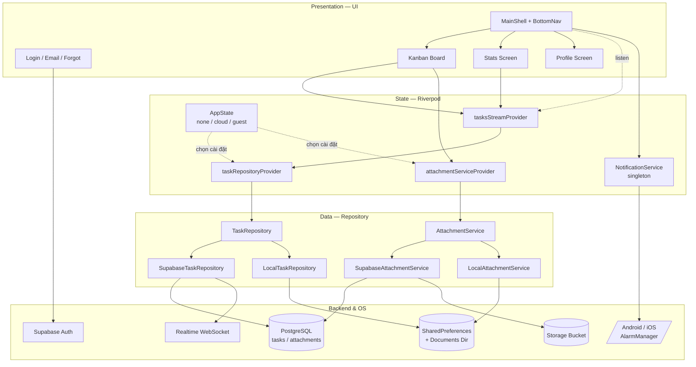
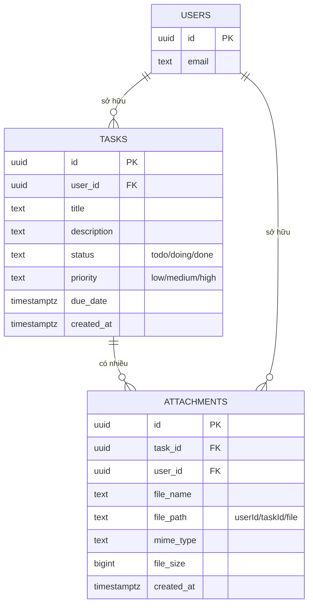
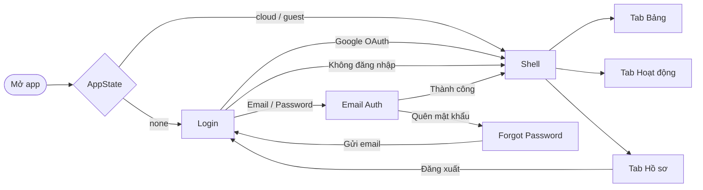
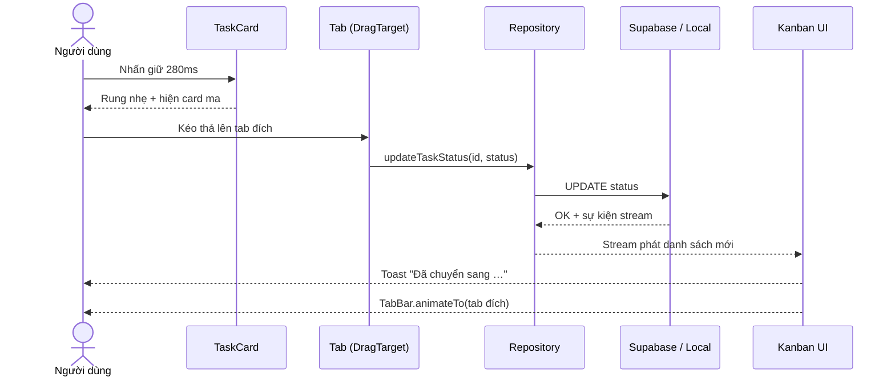
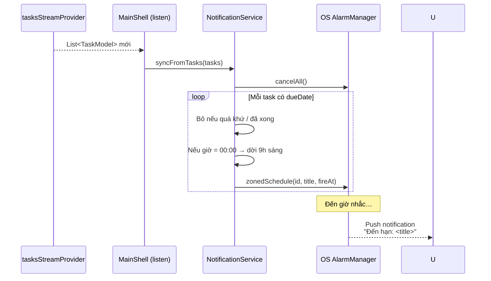

# BÁO CÁO MÔN HỌC: KỸ THUẬT PHẦN MỀM ỨNG DỤNG

**Đề tài:** Xây dựng Ứng dụng Mobile Quản lý Công việc Cá nhân theo mô hình Kanban (*Personal Task Kanban*)

## I. THÔNG TIN SINH VIÊN THỰC HIỆN

| Họ tên | Mã SV / Lớp | Email | Vai trò |
|---|---|---|---|
| Ngô Thu Hương | 22A1701D0110 | ngothekhuyen205@gmail.com | Thực hiện toàn bộ đề tài (Thiết kế – Lập trình – Kiểm thử – Báo cáo) |

## II. GIỚI THIỆU VÀ PHÂN TÍCH YÊU CẦU BÀI TOÁN

### 1. Mục tiêu
Xây dựng một ứng dụng **Mobile đa nền tảng (Android/iOS)** giúp người dùng cá nhân quản lý công việc theo mô hình **Kanban** (Cần làm → Đang làm → Hoàn thành). Ứng dụng **đồng bộ dữ liệu thời gian thực** qua Cloud, **hoạt động ngoại tuyến** khi chưa đăng nhập, **đính kèm tệp** (ảnh, âm thanh, PDF…), đặt **hạn hoàn thành** cho mỗi việc, **nhắc hạn bằng thông báo đẩy** ngay trên thiết bị và cung cấp **thống kê trực quan** về tiến độ.

### 2. Công nghệ sử dụng
- **Mô hình phát triển:** Agile — cá nhân, chia thành 4 Sprint, mỗi Sprint 4–5 ngày.
- **Ngôn ngữ / Framework:** **Flutter 3.x (Dart SDK ^3.11.4)** — 1 codebase chạy Android, iOS, Web, macOS, Windows, Linux.
- **Quản lý trạng thái:** **Riverpod 3.x** (`flutter_riverpod`, `riverpod_annotation`, `riverpod_generator`).
- **Backend & Database:** **Supabase** (PostgreSQL + Realtime + Authentication + **Storage**).
- **Xác thực:** Supabase Auth (Email/Password + Quên mật khẩu) kết hợp `google_sign_in` và OAuth deep link.
- **Tệp đính kèm:** `file_picker`, `just_audio` (player), `open_filex` (mở tệp), `path_provider` (thư mục cục bộ).
- **Thông báo đẩy cục bộ:** `flutter_local_notifications ^17.2.4` + `timezone ^0.9.4` — lên lịch nhắc hạn theo giờ địa phương, hoạt động ngay cả khi app đóng hoặc thiết bị khởi động lại.
- **Lưu trữ cục bộ:** `shared_preferences` + file system cho chế độ khách.
- **Cấu hình bảo mật:** `flutter_dotenv` — tách khóa Supabase ra file `.env`.
- **Thiết kế giao diện:** Material 3 + hiệu ứng **Liquid Glass / Frosted Glass** (BackdropFilter + mesh gradient).
- **Công cụ hỗ trợ:** Google AI Studio (Gemini) / Claude làm "trợ lý lập trình" theo phương pháp **Vibe Coding**, Visual Studio Code, Android Studio, Supabase Studio, Git.

### 3. Phương pháp tiếp cận (Vibe Coding)
Sử dụng AI làm trợ lý để sinh khung code, đề xuất schema, refactor Clean Architecture, debug OAuth deep link và Realtime stream. Sinh viên đọc kỹ từng dòng code AI sinh ra, tùy chỉnh cho phù hợp yêu cầu và tự kiểm thử trước khi nhận là "xong".

## III. MÔ TẢ QUÁ TRÌNH PHÁT TRIỂN VÀ THIẾT KẾ

### 1. Quy trình phát triển (Agile — cá nhân)

Dự án chia thành 4 Sprint:

- **Sprint 1 – Khởi tạo & MVP ngoại tuyến:** dựng mô hình `TaskModel`, `LocalTaskRepository` trên `SharedPreferences`, giao diện Kanban 3 tab.
- **Sprint 2 – Tích hợp Cloud:** bảng `tasks` trên Supabase với RLS + Realtime, `SupabaseTaskRepository`, xác thực Email/Password + Google OAuth + quên mật khẩu, `AppState` 3 trạng thái phiên.
- **Sprint 3 – Trải nghiệm nâng cao:** đổi AppBar cũ bằng **bottom navigation 3 tab** (Bảng / Hoạt động / Hồ sơ), **kéo-thả** task giữa các cột, **hạn hoàn thành** (date picker + badge quá hạn), **menu sắp xếp**, tìm kiếm theo cả tên và mô tả, màn **Thống kê** (ring chart + phân bổ ưu tiên).
- **Sprint 4 – Tệp đính kèm, Thông báo & Hoàn thiện:** bảng `task_attachments` + Storage bucket + RLS, `AttachmentService` song hành cloud/local, UI đính kèm với mini audio player `just_audio`, mở tệp ngoài bằng `open_filex`. Tích hợp **thông báo đẩy cục bộ** `flutter_local_notifications` với `NotificationService` tự đồng bộ lịch nhắc mỗi khi task thay đổi, xin quyền POST_NOTIFICATIONS và SCHEDULE_EXACT_ALARM trên Android 13+. Hoàn thiện UI Liquid Glass, kiểm thử, viết báo cáo.

### 2. Sơ đồ kiến trúc phần mềm

Ứng dụng tổ chức theo **Feature-first + Clean Architecture 3 lớp**. Lớp trình bày chỉ biết `TaskRepository` và `AttachmentService` ở dạng *interface*; tùy phiên đăng nhập, Riverpod sẽ gắn bản cài đặt Cloud hoặc Local. `NotificationService` là singleton toàn cục, lắng nghe stream task để tự đặt lại lịch nhắc.

### 3. Sơ đồ cơ sở dữ liệu

Hai bảng chính trên Supabase, đều bảo vệ bằng **Row Level Security** theo `auth.uid()`, và đều được đẩy vào publication `supabase_realtime` để client nhận sự kiện qua WebSocket.

File tệp vật lý lưu tại **Storage bucket `task-attachments`** (riêng tư, tối đa 50 MB/tệp). Đường dẫn tệp theo quy ước `<user_id>/<task_id>/<tên>` giúp chính sách Storage (`storage.foldername(name)[1] = auth.uid()`) cô lập tệp giữa các người dùng.

### 4. Sơ đồ điều hướng màn hình

### 5. Luồng kéo-thả thay đổi trạng thái

Người dùng nhấn giữ (≥ 280 ms + rung nhẹ) lên thẻ → UI chuyển sang chế độ kéo → thả vào tên tab mong muốn → cập nhật trạng thái → TabBar tự chuyển sang cột mới.

### 6. Luồng đồng bộ thông báo nhắc hạn

Mỗi khi `tasksStreamProvider` phát danh sách mới (do user thêm/sửa/xóa task hoặc Realtime đẩy về), `MainShell` gọi `NotificationService.syncFromTasks(tasks)` — hàm này **hủy toàn bộ lịch cũ** rồi đặt lại lịch mới chỉ cho task còn dueDate trong tương lai và chưa hoàn thành, tránh trùng và tránh sót.

## IV. CÁC CHỨC NĂNG ĐÃ TRIỂN KHAI

### 1. Đăng nhập đa phương thức
- **Google OAuth** qua Supabase (in-app browser + deep link `com.psntask.psntask://login-callback/`).
- **Email + Mật khẩu** (đăng ký / đăng nhập) với validation email và mật khẩu tối thiểu 6 ký tự.
- **Quên mật khẩu** — nhập email, Supabase gửi đường dẫn đặt lại, UI hiển thị màn hình thành công.
- **Chế độ khách (Guest)** — bỏ qua đăng nhập, lưu cục bộ.
- Tự duy trì phiên qua `AppState` + `SharedPreferences`.

### 2. Khung ứng dụng chính (MainShell) với Bottom Navigation
Sau khi đăng nhập, người dùng vào `MainShell` — một `IndexedStack` 3 trang với `GlassBottomNav` dạng pill kính mờ nổi bên dưới:

| Tab | Icon | Màn hình |
|---|---|---|
| Bảng | `dashboard` | Kanban Board |
| Hoạt động | `analytics` | Stats Screen |
| Hồ sơ | `person` | Profile Screen |

Tab đang chọn hiển thị gradient xanh + nhãn chữ; tab còn lại chỉ icon + nhãn xám. Dùng `IndexedStack` để giữ trạng thái (cuộn, nhập liệu) khi chuyển tab. `MainShell` còn đóng vai trò *cầu nối* giữa stream task và `NotificationService` — mỗi lần danh sách task đổi, lịch nhắc được đồng bộ lại tự động.

### 3. Bảng Kanban
- **3 cột** Cần làm / Đang làm / Hoàn thành dạng TabBar.
- **Kéo-thả**: `LongPressDraggable` trên thẻ + `DragTarget` trên tên tab. Kéo xong có toast phản hồi và TabBar tự chuyển sang cột đích.
- **Thẻ công việc** hiển thị: huy hiệu độ ưu tiên (THẤP/VỪA/CAO), tiêu đề, mô tả (tối đa 3 dòng), badge số tệp đính kèm, badge hạn hoàn thành, dải màu ưu tiên bên trái.
- **Action sheet** thay thế khi không tiện kéo-thả: Sửa / Chuyển cột / Xóa.

### 4. CRUD công việc
- **Thêm / Sửa** qua bottom sheet kính mờ: tên, mô tả, độ ưu tiên, **hạn hoàn thành** (date picker).
- **Xóa** với hộp thoại xác nhận.
- **Chuyển trạng thái** linh hoạt 2 chiều giữa 3 cột.
- **Đính kèm tệp** ngay trong sheet sửa task.

### 5. Tìm kiếm, Lọc, Sắp xếp
- **Tìm kiếm** theo cả **tên** lẫn **mô tả** (không phân biệt hoa thường).
- **Lọc** theo độ ưu tiên bằng chip (Tất cả / THẤP / VỪA / CAO).
- **Sắp xếp** qua menu popup 4 chế độ: mới nhất trước, cũ nhất trước, theo ưu tiên (Cao → Thấp), theo hạn (gần nhất trước).

### 6. Hạn hoàn thành (Due date)
- Chọn ngày bằng `showDatePicker` có nút xóa để đặt "không hạn".
- Badge trên thẻ tự đổi màu/chữ theo khoảng cách đến hạn:

| Tình trạng | Hiển thị | Màu |
|---|---|---|
| Quá hạn | `Quá hạn N ngày` + icon cảnh báo | Đỏ |
| Đến hạn trong 1 ngày | `Hôm nay` / `Ngày mai` | Cam |
| Trong 7 ngày tới | `Còn N ngày` | Xanh dương |
| Xa hơn | `dd/mm` | Xám |
| Task đã hoàn thành | Chữ gạch chân mờ | Xám nhạt |

### 7. Thông báo đẩy nhắc hạn (Local Notifications)
- Sử dụng `flutter_local_notifications` + `timezone` để lên lịch nhắc **chính xác theo giờ địa phương**, không cần server/FCM.
- `NotificationService.init()` được gọi ở `main()` để khởi tạo plugin, nạp timezone database, xin quyền `POST_NOTIFICATIONS` (Android 13+) và `SCHEDULE_EXACT_ALARM` (Android 12+). Trên iOS/macOS xin quyền Alert/Badge/Sound.
- **Quy tắc đặt lịch** trong `syncFromTasks(tasks)`:
  - Bỏ qua task đã hoàn thành, không có dueDate hoặc dueDate ở quá khứ.
  - Nếu user chỉ chọn **ngày** (giờ = 00:00), mặc định nhắc lúc **9 giờ sáng** hôm đó.
  - `ID notification = hashCode(task.id) & 0x7FFFFFFF` đảm bảo dương 32-bit và ổn định theo task.
  - Mỗi lần stream đổi, hàm `cancelAll()` rồi đặt lại — tránh trùng lịch cũ.
- **AndroidManifest** khai báo thêm 3 permission và 2 receiver `ScheduledNotificationReceiver` + `ScheduledNotificationBootReceiver` để lịch nhắc không bị mất sau khi máy khởi động lại.
- Nút **"Gửi thông báo thử"** ở màn Hồ sơ giúp user kiểm tra nhanh quyền thông báo đã được cấp.

### 8. Tệp đính kèm
- Hỗ trợ **ảnh / âm thanh / PDF / doc / text / video**, suy đoán mime từ đuôi nếu `file_picker` không trả về.
- **Tải lên:**
  - Cloud: upload lên Storage bucket `task-attachments` theo đường dẫn `<userId>/<taskId>/<timestamp>_<tên>`, đồng thời ghi metadata vào bảng `task_attachments`.
  - Guest: sao chép tệp vào `ApplicationDocumentsDirectory/attachments/` và lưu chỉ mục trong `SharedPreferences`.
- **Phát âm thanh tại chỗ** bằng `just_audio` — mini player có play/pause, thanh tua, thời lượng.
- **Mở tệp ngoài** bằng `open_filex` (Android/iOS/macOS/Windows). Cloud tạo **signed URL** 1 giờ.
- **Xóa tệp** — xóa cả file vật lý (Storage / đĩa) lẫn bản ghi trong DB/index.
- Thẻ Kanban hiển thị số lượng tệp (badge "📎 N tệp").

### 9. Thống kê (Stats Screen)
- **Ring chart** vẽ bằng `CustomPainter` (gradient stroke) thể hiện tỉ lệ hoàn thành (%).
- **Lưới 4 thẻ** hiển thị Hoàn thành, Đang làm, Cần làm, Tổng — mỗi thẻ có icon và màu nhấn.
- **Phân bổ theo độ ưu tiên** — 3 thanh progress (Cao / Vừa / Thấp) với số lượng và tỉ lệ.
- Khi chưa có task: hiển thị trạng thái rỗng với hướng dẫn thêm việc.

### 10. Hồ sơ (Profile Screen)
- Avatar gradient tròn hiển thị ký tự đầu email (hoặc icon khi là khách).
- Thông tin email, badge "Đã đồng bộ Cloud" / "Cục bộ (chỉ máy này)".
- Liệt kê **Phương thức đăng nhập** (Google / Email / Không tài khoản) và **Ngày tạo tài khoản**.
- Nút **"Gửi thông báo thử"**, hộp thoại "Về Kanban Cá Nhân" (About dialog) và nút **Đăng xuất** có xác nhận.

### 11. Đồng bộ Realtime
- Client gọi `supabase.from('tasks').stream(primaryKey: ['id'])` — Supabase đẩy sự kiện qua WebSocket khi có INSERT/UPDATE/DELETE. Mở app ở 2 thiết bị: thêm task ở thiết bị A, thiết bị B cập nhật trong vài trăm ms.
- Cả bảng `tasks` lẫn `task_attachments` đều được `ALTER PUBLICATION supabase_realtime ADD TABLE …`.

### 12. Giao diện "Liquid Glass"
- Nền **mesh gradient** với 4 quả cầu radial mờ ở 4 góc.
- `GlassContainer` + `BackdropFilter` dùng cho card, bottom sheet, dialog, bottom nav.
- Button chính gradient `primary → primaryContainer` có glow; button phụ kính mờ.
- Palette "Fluid Luminary": primary `#0058BB`, primaryContainer `#6C9FFF`, tertiary `#B90034`.

### 13. Đa nền tảng
1 codebase chạy được Android, iOS, Web, macOS, Windows, Linux. Deep link OAuth cấu hình trong `AndroidManifest.xml` (scheme `com.psntask.psntask`, host `login-callback`).

## V. PHÂN CÔNG CÔNG VIỆC

Đề tài do **một sinh viên thực hiện toàn bộ**:

| Thành viên | Nhiệm vụ chi tiết |
|---|---|
| **Ngô Thu Hương** | – Khởi tạo dự án Flutter đa nền tảng, cấu hình `.env`, Supabase Project. – Thiết kế cơ sở dữ liệu (bảng `tasks`, `task_attachments`) + RLS + publication realtime + Storage bucket với policy folder-per-user. – Lập trình toàn bộ lớp Domain & Data: `TaskModel`, `TaskAttachment`, `TaskRepository` (Supabase + Local), `AttachmentService` (Supabase + Local). – Xác thực đa phương thức (Google OAuth, Email, Guest, Quên mật khẩu) và `AppState` quản lý phiên. – Thiết kế hệ design system **Liquid Glass** (`GlassContainer`, `GlassButton`, `GlassBackground`, `GlassBottomNav`). – Lập trình MainShell 3 tab, màn Kanban với kéo-thả, due date, sắp xếp, tìm kiếm, lọc; màn Stats với ring chart + phân bổ; màn Profile. – Tích hợp `file_picker` + `just_audio` + `open_filex` cho tệp đính kèm, viết mini audio player. – Tích hợp `flutter_local_notifications` + `timezone`, viết `NotificationService` tự đồng bộ lịch nhắc theo stream task; cấu hình permission và receiver trong AndroidManifest. – Tích hợp Supabase Realtime qua stream Riverpod. – Kiểm thử thủ công, xử lý lỗi nhập liệu, lỗi mạng, lỗi OAuth. – Soạn thảo tài liệu và báo cáo. |

## VI. KẾT QUẢ ĐẠT ĐƯỢC VÀ HẠN CHẾ

### 1. Kết quả đạt được
- **Hoàn thành đầy đủ yêu cầu đề bài** (đăng nhập Google, Kanban, CRUD, bộ lọc, realtime, schema chuẩn) và **vượt yêu cầu** ở nhiều điểm:
  - **Chế độ khách** cho dùng ngoại tuyến.
  - **Kéo-thả** thật giữa các cột (không chỉ nhấn nút).
  - **Hạn hoàn thành** kèm badge cảnh báo quá hạn.
  - **Thông báo đẩy cục bộ** nhắc hạn, tự đồng bộ lịch khi task đổi.
  - **Đính kèm tệp** đa định dạng + phát âm thanh tại chỗ.
  - **Thống kê** với ring chart và phân bổ ưu tiên.
  - **Điều hướng 3 tab** bằng bottom nav kính mờ.
- **Kiến trúc sạch** (Clean Architecture, Repository Pattern, Provider động) — đổi nguồn dữ liệu không phải sửa UI.
- **Bảo mật nhiều lớp:** `.env` + RLS trên bảng + RLS trên Storage dựa vào cấu trúc folder.
- **UI hiện đại** phong cách Liquid Glass, chạy mượt 60fps trên Android tầm trung.
- Áp dụng thành công Vibe Coding — rút ngắn thời gian lập trình khoảng 2–3 lần.

### 2. Hạn chế còn tồn tại
- **Chưa kéo-thả *giữa các cột đang hiển thị*** trên cùng màn hình — hiện chỉ kéo lên tên tab (do thiết kế tab-based, không phải multi-column view).
- **Chưa có nhãn/tag hoặc nhóm dự án** — toàn bộ task nằm chung một danh sách.
- **Thông báo đẩy chỉ là cục bộ (local)** — nếu đăng nhập cloud ở nhiều thiết bị, mỗi máy sẽ tự đặt lịch riêng; chưa có backend đẩy thông báo đồng nhất qua FCM/APNs.
- **Chưa đồng bộ offline-first** cho tài khoản cloud — khi mất mạng ở chế độ cloud, app sẽ lỗi stream thay vì ghi đè tạm lên local.
- **Chưa có test tự động** (unit/widget test) — kiểm thử hoàn toàn thủ công.
- **Mở tệp cloud chưa launch URL trong browser** — hiện hiển thị signed URL trong dialog để user copy (do chưa tích hợp `url_launcher`).

## VII. CÁC CÂU PROMPT ĐIỂN HÌNH (Vibe Coding)

Sinh viên sử dụng prompt có cấu trúc (Vai trò → Ngữ cảnh → Yêu cầu → Ràng buộc → Tiêu chí) thay vì câu lệnh ngắn, để AI sinh code đúng convention, tốn ít vòng chỉnh sửa. Dưới đây là 8 prompt điển hình.

### Prompt 1 — Thiết kế mô hình dữ liệu Task có due date

**Vai trò:** Flutter engineer 5 năm kinh nghiệm, tuân thủ Clean Architecture và immutable data.
**Ngữ cảnh:** Dự án Kanban `psntask`, backend Supabase PostgreSQL, guest dùng `SharedPreferences`.
**Yêu cầu:** Viết class `TaskModel` gồm: `id`, `title`, `description`, `status` (enum todo/doing/done), `priority` (enum low/medium/high), `createdAt`, `dueDate` (nullable).
**Ràng buộc:** Immutable; có `fromJson`, `toJson`, `copyWith` (hỗ trợ `clearDueDate` để xóa hạn); khi `id.isEmpty` không đưa `id` vào map (để Supabase tự sinh UUID); `due_date` trong JSON có thể null hoặc chuỗi rỗng.
**Tiêu chí:** Pass `flutter analyze`, tương thích với schema `tasks` đã thiết kế.

### Prompt 2 — Repository Pattern hai nguồn dữ liệu

**Vai trò:** Kiến trúc sư phần mềm mobile, hiểu Repository Pattern và Stream reactive.
**Ngữ cảnh:** App Flutter có 2 chế độ: cloud (Supabase, realtime) và guest (SharedPreferences). UI không được biết đang dùng nguồn nào.
**Yêu cầu:** Abstract class `TaskRepository` + `SupabaseTaskRepository` (dùng `stream(primaryKey: ['id']).order('created_at', ascending: false)`) + `LocalTaskRepository` singleton (`StreamController.broadcast()` + `_ensureLoaded()`).
**Ràng buộc:** Cùng interface; `LocalTaskRepository` sinh id bằng `DateTime.now().microsecondsSinceEpoch`; không dùng package ngoài `shared_preferences`.
**Tiêu chí:** Đổi nguồn chỉ bằng cách thay Provider — không sửa 1 dòng UI.

### Prompt 3 — Schema SQL + RLS + Storage

**Vai trò:** PostgreSQL DBA, am hiểu Supabase Auth và Storage.
**Ngữ cảnh:** App đa user. Mỗi user chỉ thao tác task và file của chính mình.
**Yêu cầu:** Viết 2 migration: (1) bảng `tasks` với `due_date TIMESTAMPTZ` nullable, RLS 4 policy, realtime; (2) bảng `task_attachments` (FK `task_id` có `ON DELETE CASCADE`, `user_id` default `auth.uid()`, `file_name`, `file_path`, `mime_type`, `file_size BIGINT`) + index trên `task_id` + RLS + realtime. Kèm Storage bucket `task-attachments` private, giới hạn 50 MB/tệp. Storage policy dựa trên cấu trúc folder: `storage.foldername(name)[1] = auth.uid()::text`.
**Ràng buộc:** Comment tiếng Việt; cú pháp PostgreSQL 15.
**Tiêu chí:** User A không đọc/sửa/xóa/tải file của user B dù cố gắng gọi API trực tiếp.

### Prompt 4 — Kéo-thả task giữa các tab

**Vai trò:** Flutter engineer chuyên UX tương tác.
**Ngữ cảnh:** Màn Kanban dùng `TabBar` 3 cột (Cần làm / Đang làm / Hoàn thành). Cần kéo thẻ thả lên tên tab để đổi status.
**Yêu cầu:** Bọc thẻ task trong `LongPressDraggable<TaskModel>` (delay 280 ms, `HapticFeedback.mediumImpact()` lúc bắt đầu, hiện card ma 35% khi đang kéo); bọc mỗi `Tab` trong `DragTarget<TaskModel>` — khi nhận thì gọi `updateTaskStatus`, toast phản hồi, và `_tabController.animateTo(index)`. Tab chỉ nhận nếu `details.data.status != status` của nó.
**Ràng buộc:** Không dùng package ngoài. Giữ nguyên layout TabBar.
**Tiêu chí:** Nhấn giữ 280 ms rung nhẹ → kéo lên tên tab khác → thả → task nhảy sang cột đúng với toast đúng tên. Không lỡ trigger khi chạm ngắn.

### Prompt 5 — Tệp đính kèm với Supabase Storage + Local Mirror

**Vai trò:** Fullstack Flutter + Supabase engineer.
**Ngữ cảnh:** Mỗi task có thể đính kèm nhiều tệp (ảnh, audio, PDF, doc...). Cloud user lưu Supabase Storage; guest lưu vào `ApplicationDocumentsDirectory`.
**Yêu cầu:** Abstract `AttachmentService` với `listForTask`, `upload`, `delete`, `getViewableUrl`. Cloud impl: upload theo path `<userId>/<taskId>/<timestamp>_<fileName>`, insert row `task_attachments`, `getViewableUrl` trả signed URL 1 giờ. Local impl: `file.copy()` vào thư mục `documents/attachments/`, index trong SharedPreferences key `guest_attachments`, `getViewableUrl` trả `filePath`.
**Ràng buộc:** Suy đoán mime type từ đuôi file nếu `file_picker` không trả về (audio/mpeg, image/png, application/pdf…). Xóa tệp phải xóa cả file vật lý lẫn record. Không lộ chi tiết backend lên UI.
**Tiêu chí:** Cả 2 implementation cùng interface; chuyển chế độ không phải sửa UI.

### Prompt 6 — Màn Thống kê với Ring Chart tự vẽ

**Vai trò:** Flutter engineer chuyên visualization.
**Ngữ cảnh:** Tab "Hoạt động" trong MainShell, hiển thị tiến độ dựa trên `tasksStreamProvider`.
**Yêu cầu:** `StatsScreen` gồm: tiêu đề lớn, ring chart 170×170 vẽ bằng `CustomPainter` (vòng nền xám + vòng tiến độ gradient `primary → primaryContainer`, stroke 14, `strokeCap.round`, bắt đầu từ `-π/2`); giữa ring hiển thị `<số>%` và label "Đã hoàn thành"; 4 stat card (Hoàn thành / Đang làm / Cần làm / Tổng) dùng icon + màu nhấn; 3 priority bar (Cao / Vừa / Thấp) dùng `LinearProgressIndicator` bo tròn.
**Ràng buộc:** Không dùng fl_chart hay syncfusion. Khi tổng = 0 hiển thị trạng thái rỗng đẹp (icon + hướng dẫn).
**Tiêu chí:** Chạy mượt khi `tasksStreamProvider` đổi (rebuild không giật).

### Prompt 7 — Badge hạn hoàn thành với logic tương đối

**Vai trò:** Flutter engineer chuyên UX ngày-giờ.
**Ngữ cảnh:** Thẻ task hiển thị badge hạn hoàn thành.
**Yêu cầu:** Widget `_DueDateBadge` nhận `dueDate` và `isDone`. Tính `diff = due - today`: `isDone` → gạch chân xám icon event_available; `diff < 0` → "Quá hạn N ngày" + warning + đỏ; `diff == 0` → "Hôm nay" cam; `diff == 1` → "Ngày mai" cam; `diff ≤ 7` → "Còn N ngày" xanh; còn lại → `dd/mm` xám.
**Ràng buộc:** Chỉ so sánh phần ngày (bỏ giờ) để tránh lệch múi giờ. Không dùng package `intl`.
**Tiêu chí:** Badge tự đổi mỗi khi mở lại app qua ngày mới.

### Prompt 8 — Thông báo đẩy cục bộ nhắc hạn task

**Vai trò:** Flutter engineer chuyên platform integration (Android/iOS).
**Ngữ cảnh:** App cần nhắc user đúng giờ khi task đến hạn. Không có server → dùng `flutter_local_notifications` + `timezone`. Phải đồng bộ lại lịch mỗi khi danh sách task đổi (thêm, sửa dueDate, chuyển sang Done, xóa) — kể cả khi đổi đến từ Supabase Realtime của thiết bị khác.
**Yêu cầu:** Viết class `NotificationService` singleton: (a) `init()` gọi 1 lần ở `main()` — nạp timezone DB, xin quyền POST_NOTIFICATIONS (Android 13+), SCHEDULE_EXACT_ALARM (Android 12+), Alert/Badge/Sound (iOS/macOS); (b) `showNow(title, body)` để test; (c) `syncFromTasks(List<TaskModel>)` hủy toàn bộ lịch cũ bằng `cancelAll()` rồi `zonedSchedule` lại cho task có dueDate trong tương lai và chưa Done. Nếu user chỉ chọn ngày (giờ 00:00) mặc định nhắc lúc **9h sáng** hôm đó. `id = task.id.hashCode & 0x7fffffff`. Trong `MainShell`, dùng `ref.listen(tasksStreamProvider)` gọi `syncFromTasks`.
**Ràng buộc:** Dùng `AndroidScheduleMode.exactAllowWhileIdle`. Khai báo trong `AndroidManifest`: 3 permission và 2 receiver `ScheduledNotificationReceiver` + `ScheduledNotificationBootReceiver` để lịch sống sót qua reboot.
**Tiêu chí:** Tạo task có dueDate ngày mai → đóng app → đến 9h sáng hôm sau vẫn nhận được thông báo "Đến hạn: …". Khi chuyển task sang Done, thông báo tương ứng bị hủy.

## VIII. CÁC ĐƯỜNG DẪN QUAN TRỌNG

- **Link Source Code (GitHub / Drive):** *(sinh viên bổ sung khi nộp)*
- **Link APK demo (build release):** *(sinh viên bổ sung khi nộp)*
- **Video demo ứng dụng:** *(sinh viên bổ sung khi nộp)*
- **Supabase Project URL:** https://bzihpvybbfanesxpstts.supabase.co
  *(Anon key lưu trong file `.env` cục bộ, không công khai.)*

*Báo cáo được soạn thảo bởi Ngô Thu Hương — Lớp 22A1701D — Môn Kỹ thuật Phần mềm Ứng dụng.*
